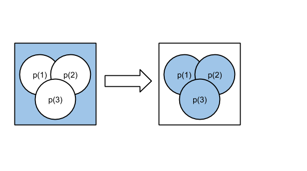

Probabalistic Clafer Model
==========================

This folder contains Clafer models related to the exploration of modeling probability in Clafer. This README is structured as follows: 
* Section 1 gives an overview of the example that I am using in many of the models
* Section 2 gives an overview of each of the models that implements the example given in Section 1.

## Table of Contents ##
- [Section 1: Reliability Example](#section-1-reliability-example)
- [Section 2: Clafer Models for Reliability Example](#section-2-clafer-models-for-reliability-example)
  - [probClaferExample - A first approach](#probclaferexample---a-first-approach)
	- [probClaferExample2 - The road to Rationals and Functions](#probclaferexample2---the-road-to-rationals-and-functions)
		- [Probabilities as Rationals](#probabilities-as-rationals)
		- [Introducing Fault Expression "Functions"](#introducing-fault-expression-functions)
	- [probClaferExample4 - Ports, Connections, and a Smarter Model](#probclaferexample4---ports-connections-and-a-smarter-model)
		- [Ports and Connections](#ports-and-connections)
		- [Components and the System](#components-and-the-system)
		- [Adding Failures to Ports and Components](#adding-failures-to-ports-and-components)
		- [Concluding Thoughts](#concluding-thoughts)
  - [productExample](#productexample)
	  - [The 'product' Construct](#the-product-construct)
	  - [The New Failure Expressions](#the-new-failure-expressions)
	- [probClaferExampleDNC](#probclaferexamplednc)
	  - [Nested Inheritance](#nested-inheritance)
	  - [Redefinition](#redefinition)
	  - [How much do we automate?](#how-much-do-we-automate)


## Section 1: Reliability Example ##
This is just an example for prototypying a Clafer model for reliability analysis. We
consider the following example taken from Figure 4.14 in "Reliability Engineering and Risk
Analysis" by Mohammad Modarres, Mark Kaminskiy, Vasiliy Krivtsov

*Structural model::*
```
                   ---
           |----->| A |------->|
  ---      |       ---         |        ---
 | X | ----|       ---         |------>| Y |
  ---      |----->| B |------->|        ---
           |       ---         |
           |    ---     ---    |
           |-->| C |-->| D |-->|
                ---     ---
```

Assume that blocks A, B, C, and D all have a basic event "InternalFailure" but we denote it
as the block letter in the fault tree (i.e. "InternalFailure of A" will just be "A"). In this
example we are interested in seeing if we send data from X (not including in the reliablilty
analysis) what is the probability that the data will be read at Y (also not included in the
analysis). Thus, we are really just interested in the probability that the subsystem made up
of components A, B, C, and D fails.

Let us denote the top event as Y which is the event that our subsystem (A, B, C, D) fails.

The fault tree then would look as follows:

*Fault Tree::*
```
                  ---
                 | Y |
                  ---
                   ^
                   |
                 (AND)
                   ^
       |------|----|----------|
      ---    ---             (OR)
     | A |  | B |             |
      ---    ---        |------------|
                       ---          ---
                      | C |        | D |
                       ---          ---
```

Now, let us assume that the basic events of A, B, C, D have the following probabilities:

| Component     | Probability   |
| :-----------: |:-------------:|
| A             | 0.1           |
| B             | 0.1           |
| C             | 0.1           |
| D             | 0.2           |

We can find the probability of C or D failing using the formula for the OR Gate.
Note that the probability at the OR gate is given by the following formula if x,y,z are
independent but not mutually exclusive events (Eq 2.15):

```P_OR(x,y,z) = P(x) + P(y) + P(z) - P(x,y,z)```

Thus,

```P_OR(C,D) = P(C)+P(D)-P(C)*P(D) = 0.28```

We can find the probability of T then by using the previous result in our AND Gate.
Note that the probability at the AND gate is given by the following formula if x,y,z are
independent events (Eq 2.13):

```P_AND(x,y,z) = P(x)*P(y)*P(z)```

Thus,

```P(Y) = P_AND(A,B,P_OR(C,D)) = 0.1*0.1*0.28 = 0.0028```

## Section 2: Clafer Models for Reliability Example ##
This section contains a number of Clafer models that have been used to model the reliability example described in Section 1. Each model has itteratively built on the previous version with changes suggested by fellow researchers in the GSD lab at UW and at ITU. This section is laid out by describing each model indiviudally. The sub section names coorespond to the file names. While these sections give a nice overview of what each model has to offer, each model contains detail comments to explain methodology and constructs used in the particular model.

### probClaferExample - A first approach ###
- **Built with Clafer Compiler v3.6.1**
- **Instances generated with Clafer Choco IG v3.6.1**

This model is the very first attempt to model the reliability example. This model laid the ground work for a lot of the refactoring to come in the later models. The model conatins a few main elements:
- Structural Model : This contains the information about what components are connected together. There was one main abstract Clafer that was used to represent a component in the system, namely Component. This "Component" models a single block in our diagram from Section 1. The Clafer for the abstract Component is shown below. The constraints on the inputs and outputs allow us to only specify either the inputs to a compoent or the outputs. For example, if I say that *Component A* has an output to *Component B* it will all *Component A* to the inputs of *Component B*
```
abstract Component
    inputs -> Component *
        [parent in this.outputs]
    outputs -> Component *
        [parent in this.inputs]
```
- Probability : The probability is the most important thing to model correctly when conducting reliability analysis. In this example we take a simple approach to how a probability value is modeled. We simply say that a probability is an integer and we then have a scale factor that we introduce in the model that will act much like a denominator. This concept is something that is refined in the later models.
- Failures : A failure in this model is given by a FailureExpression which is just a probability. We also introduce an abstract Clafer for a basic event whiich is just a name for a proability (these are the lowest level events that cause failures in a fault tree). Each component in the model has a failure expression which repesents (implicity) the probability that a compoent will fail. This failure expressions are referenced from other components directly to show propogation of failures (another thing that will be refined in later models). Lastly the failure expressions are given by explicity formulas by the user which is not a good way for a user to create a failure model.

### probClaferExample2 - The road to Rationals and Functions ###
- **Built with Clafer Compiler v3.6.1**
- **Instances generated with Clafer Choco IG v3.6.1**

This model in itself was revised many times to put forth a clean way of modeling the reliability example. As the section title suggests, this is the model where we introduce the notion of rational numbers for probabilty and create "functions" to represent some failure expressions. This model does make any notable changes to how the structural system is modeled from the previous version.

#### Probabilities as Rationals ####
In this section we introduce new abstract Clafers that are used to model probabilities as rational numbers. We define a rational number as just a numerator and denominator as follows:
```
abstract Rational
    numerator  ->> integer
    denominator ->> integer
```
Then each probability value is no longer an integer but rather a rational number. This allows us to be precise in modeling numbers between 0 and 1. Obviously these rationals suffer from some limitations with the biggest one being that it is not feasible to have probabilities (that we operate on many times) to be very small (i.e. 1e-6). It will become even more apparent in the next section why this is the case.

#### Introducing Fault Expression "Functions" ####
The word function is in quotes because Clafer (at least at the moment) does not support functions that people may be accustomed to thinking about. In this model however we create these so called "Functions" to create multiple types of failure expressions. Each failure expression has at least one operand and can possibly have a second depending on the type of failure expression.

The first failure expression that we look at is the NOP which is defined as follows:
```
abstract NOP : FailureExpression
    [no operand2]
    tempNumerator ->> integer = operand1.numerator
    tempDenominator ->> integer = operand1.denominator
    [this.numerator = tempNumerator]
    [this.denominator = tempDenominator]
```
The NOP does not have a second operand because what its purpose is, is to lift a basic event (another probability) to a failure expression. This is used because we don't ever want to directly reference a basic event of a different component (and in the future not even the failure expression).

The second failure expression is the AND which is defined as follows:
```
abstract AND : FailureExpression
    [operand2]
    tempNumerator ->> integer = operand1.numerator*operand2.numerator
    tempDenominator ->> integer = operand1.denominator*operand2.denominator
    [this.numerator = tempNumerator]
    [this.denominator = tempDenominator]
```
The AND failure expression performs the boolean operation of "and" on two probabilities. As it was discussed in Section 1 that constitutes multiplying the two probability values together. When you have rational numbers what happens is you must multiply both the numerators and denominators together. For example:
```
  1      2      2
 ---  * --- =  ---
 100     5     500
```

The last failure expression that we support in this model is the OR. Like the AND it is a boolean operation on two probabilites and is defined mentioned in Section 1. It is defined as follows:
```
abstract OR : FailureExpression
    [operand2]
    tempExp ->> integer = (operand1.numerator*operand2.denominator)
    tempExp2 ->> integer = (operand2.numerator*operand1.denominator)
    tempNumerator ->> integer = tempExp+tempExp2 - (operand1.numerator*operand2.numerator)
    tempDenominator ->> integer = operand1.denominator * operand2.denominator
    [this.denominator = tempDenominator]
    [this.numerator = tempNumerator]
```
The OR failure expression constitues adding two rational numbers and then subtracting the product of the two. The multiplication is easy and mimics the AND failure expression. The addition is where things can get hairy. First off we know from elementry mathematics that two add two rational numbers they must have the same denominator. To do this we could implement a GCD algorithm but that is not trivial (or practical) in a modeling language such as Clafer. Thus we simply multiply the denominator of the two numbers and multiply the numerator of each operand of the others denominator. Since we are just multiplying the denominators together it allows us to then subtract the product of the two operands with out any manipulation. For example:
```
 2      1       2     1 
--- +  ---  -  --- * ---
 5      8       5     8

   2*8 + 1*5     2      21-2
= ----------- - ---  = ------
      5*8       5*8      40

   19
= ----
   40
```

### probClaferExample4 - Ports, Connections, and a Smarter Model
- **Built with Clafer Compiler v3.6.1**
- **Instances generated with Clafer Choco IG v3.6.1**

As opposed to the model in the previous section we focus on the structural aspect of the model and how failures are propogated and not as much on how failures are modeled.

#### Ports and Connections ####
In this model we introduce two new concepts, ports and connections. Previously these were implicitly defined by just specifiying the inputs and outputs. This is however not a practical way to model systems or to capture the reliability as different inputs might have different failures (and the same goes for outputs). We define a port as follows:
```
abstract Port
    failure -> PortFailure ?
    xor type
        output
        input
```
We will ignore the failure part until a later section but we see that a port can be of input or output type and can have a failure associated with that port. We also need a connection that will connect two ports (of different components) together so that failures may propogate (and other values in the future). A connection is defined as follows:
```
abstract Connection
    source -> Port
    sink -> Port
    // We want to propogate errors from the source to the sink.
    [sink.failure.ref = source.failure.ref]
```
As we can see a connection contains a reference to two ports and we then introduce a constraint that will propogate the failure from the source port to a sink port.

With these two new constructs we need a to make some changes to our components and system which we will discuss in the next section
#### Components and the System ####
Components in the pevious models were fairly basic, they just defined some inputs and outputs and some simple constraints on them. Now that we have introduced the notion of ports and connections we need to modify our Component model and introduce a new construct "System". A component is defined as follows:
```
abstract Component
    ports -> Port *
    inputPorts -> InPort *
    outputPorts -> OutPort *
    // Populate the inputPorts set with all the ports who are type input
    [all p : ports | (p in inputPorts) <=> p.type.input]
    // Remove all nodes in inputPorts that don't belong to ports
    [no n : inputPorts | !(n in ports)]
    // Populate the outputPorts set with all the ports who are type output
    [all p : ports | (p in outputPorts) <=> p.type.output]
    // Remove all nodes in outputPorts that don't belong to ports
    [no n : outputPorts | !(n in ports)]
```
As we can see this is much more complex. We now have multiple ports associated with a Component which can be input or output. We then define some constraints so that a user only has to defined the set of ports that they use in their component and it will populate the sets of input and output ports.

We also introduce a new construct named "System" which is where the sets of components and connections are stored. The system is defined as follows:
```
abstract System
    connections -> Connection *

    // For every Connection in System add it to the set connections
    // How would I say:
    // "For all Connection as c, c is in connections iff c.parent is this"
    [all c : Connection | (c in connections)]

    // Make a constraint for these as well
    sourceComponents -> SourceComponent *
    sinkComponents -> SinkComponent *
    components -> Component *
```
Serious caution should be used when using this construct as is as Clafer does not handle retrieving all Clafers of Connection correctly for just the system. It will retrieve ALL of the Connection Clafers in the model, this change is in the works. The system holds the sets of connections as well as the different types of components.

#### Adding Failures to Ports and Components ####
As we saw in the Ports and Connections section we had a reference to a PortFailure. This new Clafer is introduced to model a failure associated with a specific port that will be propogated to connected ports. Before we introduce PortFailure I need to introduce the Failure Clafer as follows:
```
abstract Failure : Probability
    xor FailureClassification
        Omission
        Comission
```
A failure is now defined as a probability with a failure classification. The failure classification is a new concept that is used to distiguish what type of failure it is. Two common types are Omission and Comission which mean that a value is not present but expected and a value is incorrect respectively. A port failure is then defined as follows:
```
abstract PortFailure : Failure
    exp -> FailureExpression
    [exp.FailureClassification.Omission => this.FailureClassification.Omission]
    [exp.FailureClassification.Comission => this.FailureClassification.Comission]
    [this.numerator = exp.numerator.ref]
    [this.denominator = exp.denominator.ref]
```
A port failure is a failure that is made up of a failure expression that is similiar to that of the probClaferExample2 model. The constraints on this construct just make sure that we propogate the failure classification to the port failure as well as set the numerator and denominator from the failure expression result.

We also introduce a component failure construct that is used to model when a component has failed. This construct does not propogate a failure to future components and can be thought of as top level events in the fault tree. It is almost identical to a port failure in terms of its definition and is defined as follows:
```
abstract ComponentFailure : Failure
    exp -> FailureExpression
    [exp.FailureClassification.Omission => this.FailureClassification.Omission]
    [exp.FailureClassification.Comission => this.FailureClassification.Comission]
    [this.numerator = exp.numerator.ref]
    [this.denominator = exp.denominator.ref]
```

#### Concluding Thoughts ####
This model changes alot of the structural information of the model as well as introducing some concepts for associating failures to ports and components. This model will need to be refined as the Clafer language develops so that we can create smarter constraints to limit the amount of information the modeler needs to enter to model their system. With this changes it becomes possible to model a case study example such as a automotive power window.

### productExample ###
- **Built with Clafer Compiler v0.3.8**
- **Instances generated with Clafer Choco IG v0.3.8**

We take a slight detour here and explore an exciting new construct that was recently introduced to Clafer. As per request there now exists a construct to take a product over a set or bag of integers! The construct is still early on in its release so there are some quirks that still need to be worked out but this is a big step forward. This section is going to take a small slice of the probExampleClafer models and just focus on the failure expressions.

#### The 'product' Construct ####
Before we go into the failure expressions we give a simple example of how the product example works as follows:
```clafer
abstract N ->> integer

n1 : N = 1
n2 : N = 2
n3 : N = 3
n4 : N = 2
n5 : N = 3

p -> integer = product N
```
This simple example will take the product over the **bag** (1, 2, 3, 2, 3) which evaluates to 36

##### Current Limitations #####
As stated earlier, the product construct is still in its early stages of release so there are some limitiations that have not been addressed yet. This section will be updated as they do become updated as well as updates to the models. The big limitation right now is the max size of the integer. When you run the Choco IG you must specify the max and min int (of course there are defaults). This max (and min) integer has to be greater than the biggest integer your model will generate. For example if we are multiplying 10 and 100 for our denominators I would need a max int of 1000 to generate instances. Now, lets say our max integer is 2000 (still not large enough for our probClaferExample models) and we perform a product on at most 3 integers. Choco because of the solver it uses needs to calculate the upper bound of every expression. For the product expression it calculates the uppper bound (for this example) as 2000^3 = 8000000000 which is bigger than the biggest 32-bit integer so it overflows and returns 0 instances. So the short and sweet of it is that we can't use product right now in our probClaferExample models because our integers are too large.

#### The New Failure Expressions ####
Here we are going to explore each of the new failure expressions with the use of product!
##### FailureExpression #####
The first Clafer we need to change is the FailureExpression since we will now allow the user to give an arbitrary number of operands so we define it as follows:
```clafer
abstract FailureExpression : Probability
    operands -> Probability *
```
##### NOP #####
The NOP operation is relatively simple to change as well. First we can only have one operand so we enforce that with constraint C1. We then just copy the operand numerator and denominator.
```clafer
abstract NOP : FailureExpression
    [#operands = 1] // C1
    [numerator  = operands.numerator.ref]
    [denominator = operands.denominator.ref]
```
##### AND #####
The AND operation is the easiest to change since we just need to multiply the numerators and denominators of the operands.
```clafer
abstract AND : FailureExpression
    [numerator = product operands.numerator]
    [denominator = product operands.denominator]
```
##### OR #####
Lastly comes to problem child... The OR required some more thinking of how to implement. Remember back to probClaferExample2 where we first explained how the OR works. We are going to change how we implement the OR now because it is hard (and possibly impossible) to use product and sum to use the same equation. Therefore we are going to use an equivelant form of the equation. The figure below shows a Venn Diagram of 3 probabilites to illustrate our alternative from of the equation.

The left Venn Diagram is the probability that we don't have any of the events. This would equate to the following:
```
P_OR' = (1-p(1))*(1-p(2))*(1-p(3))
```
What we want is complement of this probability. Thus, if we take the complement of this probability we get the right side of the figure and we have the following equation:
```
P_OR = 1 - P_OR'
```
We can generalize this formula to be over any number of probabilities. Thus we are just taking the product over the complements of the operands and then the taking the complement of that result. Thus we need to modify our probability Clafer as follows:
```clafer
abstract Probability : Rational
    [numerator <= denominator]
    [numerator >= 0 && denominator > 0]
    complement : Rational
      [numerator = parent.denominator.ref - parent.numerator.ref]
      [denominator = parent.denominator.ref]
```
We get the complement using the fact that if we subtract 1 from a rational number we are left with:
```
1 - n/d = (d-n)/d
```

Now we can define the OR failure expression as follows:
```clafer
abstract OR : FailureExpression
    [numerator = product tempProbability.complement.numerator]
    [denominator = product tempProbability.complement.denominator]
    tempProbability : Probability
    [tempProbability.numerator = product operands.complement.numerator]
    [tempProbability.denominator = product operands.complement.denominator]
```


### probClaferExampleDNC ###
- **Built with future compiler :)**
- **Instances generated with future version of Clafer Choco IG :)**

This model is quite different from the previous versions in the fact that it does not compile or generate instances. This model is used more as a "wish list" or a guide to help develop Clafer further in identifying features that would be nice to have or could improve the performance. This version that does not compile is based off of probClaferExample5 (still in the works).

#### Nested Inheritance ####
The first stop on our journey to a better Clafer is nested inheritance. While this feature is not necesarily leveraged at this point (more on this later) it is a nice way to arrange Clafers together so that we can write constraints that were not possible before. Take for example our System that we introduced in probClaferExample4. We can now define it as follows:

```clafer
abstract System
    abstract Connection
        source -> Port
        sink -> Port
        [sink.failure.ref = source.failure.ref]
    
    abstract Component
        abstract Port
            failure -> PortFailure ?
        abstract OutPort : Port
        abstract InPort : Port
        
        inputPorts -> InPort *
        [inputPorts = this.InPort]
        outputPorts -> OutPort *
        [outputPorts = this.OutPort]

    abstract SourceComponent : Component
    abstract SinkComponent : Component

    connections -> Connection *
    [connections = this.Connection]

    sourceComponents -> SourceComponent *
    [sourceComponents = this.SourceComponent]
    sinkComponents -> SinkComponent *
    [sinkComponents = this.SinkComponent]
    components -> Component *
    [components = this.Component]
```

Now we can write constraints to get all of the connections that belong to a specific instance of a system which was never possible before! Again, while the benifits have not reaped for this example (yet) one could see some benifits for timing where we could sum over all connections that have some attribute or even wires.

#### Redefinition ####
Another "wish list" item that could be leveraged right away is redefinition. I will leave the semantical definition for others, but in essence what we want to be able to do is to redefine a Clafer to another Clafer. For example we can consider the PortFailure as follows:
```clafer
abstract PortFailure : Failure
    exp : FailureExpression

 pFailure : PortFailure
            exp : OR 
            [exp.operands = compD.dataIn.failure, compD.internalFailure]
```

We see that PortFailure has a child Clafer "exp" that is a FailureExpression. But, as discussed in probClaferExample2 we have refined FailureExpression into 3 other Clafers (AND, OR, NOP). We want to define PortFailure to have a general FailureExpression and then when the user instantiates a PortFailure they can *redefine* exp to be the specific operation they are looking for. This is done through the line:
```clafer
exp : OR
```

#### How much do we automate? ####
This section is a little different from the rest. I just wanted a space to share and explore some current thoughts on how much we should automate in the failure analysis. As I develop these models and introduce some of these new constructs and wish list items it becomes apparent that we could create a library of Clafers that could potentialy conduct failure analysis by simply defining some components, connections, and basic events. The downfall to this is that the systems engineer loses granularity of what they can control in the model. So my question is, at what level of granularity should we let a systems engineer model the failure analysis?
